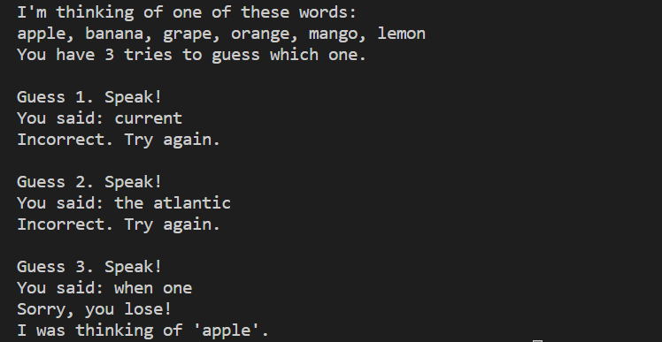
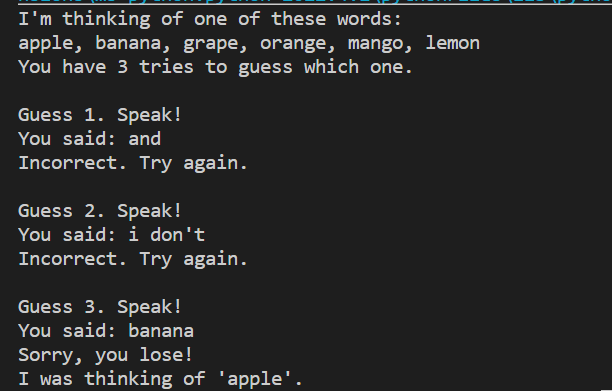
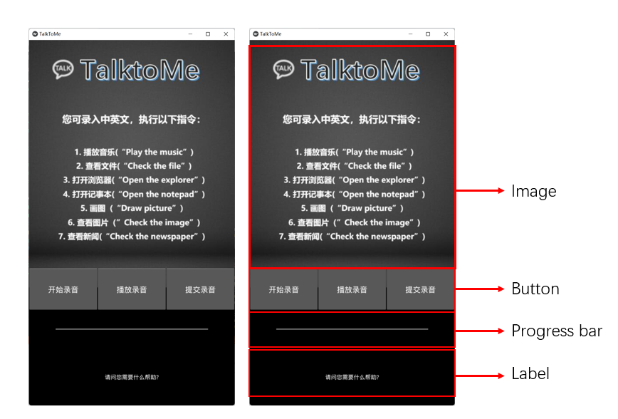
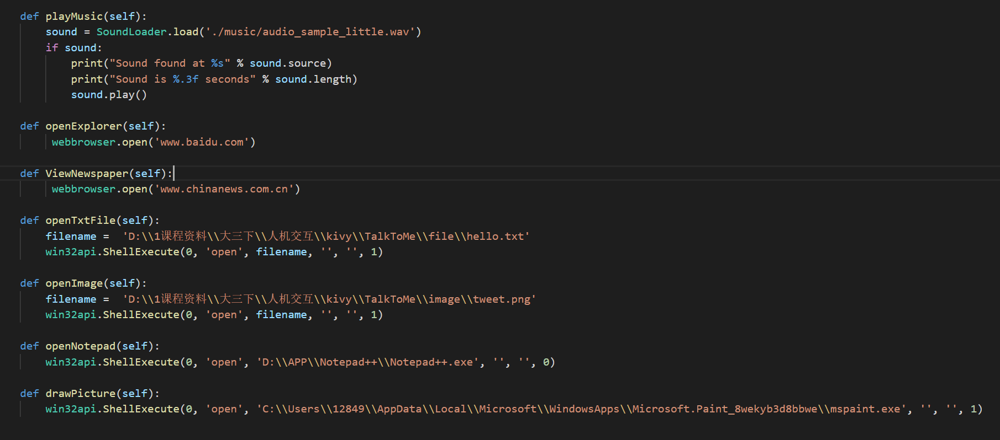

# Assignment 2

<center> 1951095  Yiwen Liang  </center>

> Requirements:
>
> 1. Run test.py and guessTheWord.py. Get familiar with the program. (In part 1)
> 1. Modify the user interface. (In part 2)
> 2. Add two functions to the program. (In part 3)

[TOC]

## 1  Runing sample programs

### 1.1 Program interpretation

#### 1.1.1 test.py

```python
# Working with audio files
r = sr.Recognizer()
speech = sr.AudioFile('f1lcapae.wav')
with speech as source:
    audio = r.record(source)
print(r.recognize_sphinx(audio))
```

This program uses the **speech_recognition** library to perform speech recognition on the recorded audio files, which requires additional use of the **PocketSphinx** library. The identified results are as follows:


```python
# Working with Microphones
mic = sr.Microphone()
with mic as source:
    r.adjust_for_ambient_noise(source)
    audio = r.listen(source)
r.recognize_sphinx(audio)
```

This program calls the local microphone to record, and the recorded audio is noise reduction audio, and then performs speech recognition directly. However, the recognition accuracy is not very high, and it needs to be re-read several times to recognize correctly.

#### 1.1.2 guessTheWord.py

The speech recognition strategy used by this program also uses the local microphone to record, and then directly recognizes the recorded audio. It first generates a random target word, then we enter the word by speech and guess the target word. However, the recognition accuracy of this program is not very high. I tried 3 to 5 times and failed to output the words I read.

The first time I recorded with my real voice, the accuracy rate was not high.



The second time I used mobile phone to read English aloud, the accuracy rate was not high, only the last word could be correctly recognized.



## 2  User interface improvements

### 2.1  Original user interface analysis


The picture above shows the original front-end interface, written in PyQt5. But the version I opened may not be the right resolution, and some words are not displayed. Because I'm recently learning an excellent python GUI library - kivy, which is able to run the same code on all supported platforms and allow us to do better cross-platform development, I decide to use kivy for user interface improvements.

> **What is kivy?**
>
> It is an open source Python library for rapid development of applications that make use of innovative user interfaces, such as multi-touch apps. It runs on Linux, Windows, OS X, Android, iOS, and Raspberry Pi. You can run the same code on all supported platforms.

### 2.2  Improve the user interface



In response to the shortcomings of the original interface, I have made improvements in 4 aspects:

1. **Functionality**

Since only Label can display application information in the original interface, general speech recognition applications should have the functions of recording and submitting. To improve usability, we can also dynamically display the information of feedback to the user. The functions I've added to this speech recognition app are:

- Start recording
- Play recording
- Submit recording
- Dynamically display feedback

For the above-mentioned added functions, the implementation of the three functions of recording is **button** triggering, and the system feedback is dynamically changed by **Label**.

The user first clicks "Start Recording", and the recording process lasts for 3s. After recording, the `test.wav` file will be generated in the `"audio"` folder.

The user then clicks "play recording" and the program is able to play the audio the user just recorded. 

The user finally clicks "Submit recording", and the recorded audio will be recognized by the Web API provided by iFLYTEK, which provides extremely fast voice transcription. The program parses the returned json result and displays it in  the label at the bottom.

2. **Interactivity**

In addition to the static display parts, our system has added some components that interact with the user, such as Button and Progress Bar. **Button** can perform actions requested by the user, **Progress bar** can dynamically display the passage of recording time, and **Label** at the bottom can dynamically display the feedback given to the user. Compared with the original user interface, ours has better interactivity.

3. **Aesthetics**

The revised interface adds the application logo and improves the displayed interface. The commands that the user can execute are displayed in the window, which is convenient for the user to use the system better.

Our layout uses the vertical layout of mobile phones, with ratio of 540*960, which is also the size of general mobile phones. It is convenient for us to transplant to mobile devices.

4. **Language conversion**

The displayed language of the user interface is changed to Chinese. Although kivy does not support Chinese, we can achieve that goal by importing Chinese font files and dynamically setting widgets to display Chinese.

## 3  Function analysis

**To improve the accuracy of speech recognition and the functionality of this system**, we have made the following improvements:

### 3.1 Record/play

Both of these functions use the `PyAudio` library instead of the `speech_recognition` packaged library. Because this makes it easier for us to modify the value of progress bar when recording audio, and display the recording duration in real time.

### 3.2 Speech recognition

**In order to improve the accuracy of speech recognition**, we use the extremely fast speech API provided by `iFLYTEK`. This function is based on a deep full-sequence convolutional neural network, which can convert long audio data (within 5 hours) into text data. The speech recognition function is encapsulated in `XunfeiApi.py`, which can recognize Chinese/English with high accuracy.

### 3.3 Speech command

In this system, user can choose to record Chinese/English commands, and realize the corresponding functions through the following 7 commands:

- Play the music
- Check the file
- Open the explorer
- Open the notepad
- Draw picture
- Check the image
- Check the newspaper

The voice command implementation functions are mainly encapsulated in `voiceControl.py`. **Playing music** is implemented by the audio playback function that comes from kivy, **opening the browse**r and **checking the news** is implemented by using the `webbrowser` library. The rest are implemented by python directly calling windows commands by `win32api`.



## 4  Operation demo

Here I've recorded a video of the program's usage, so you can observe how the dynamic interface elements change, and see the feedback from the system below. You can start the program by running `main.py` directly.

The video is `operation demo.mp4`, from which we can see that **the accuracy of recognition is very high**!

## 5  Porting attempt

I tried to port this program to Android by packaging the kivy program by Buildozer (must be in Linux). After solving some bugs, this program can be packaged into .apk file, but it will crash when running on mobile phone.

I used ADB (Android Debug Bridge) to debug and found the reason. It turned out that the compiled source file of PyAudio only supports the X86_64 architecture, not the ARM architecture. The Android phone uses ARM. If you want to port PyAudio to Android, you need to cross-compile its third-party plugin. But it is more recommended to use the `jnius` library to call Android's hardware support. In the future, we will improve our recording part in this direction.


------

Questions:

- The modifications to GUI and the codes
- The accuracy of speech recognition and how to improve it, if possible?

For question 1, I have answered it in **part 2[User interface improvements]** that how I modify the GUI.

For question 2, I have answered it in **part 3[Function analysis]** to improve its accuracy.